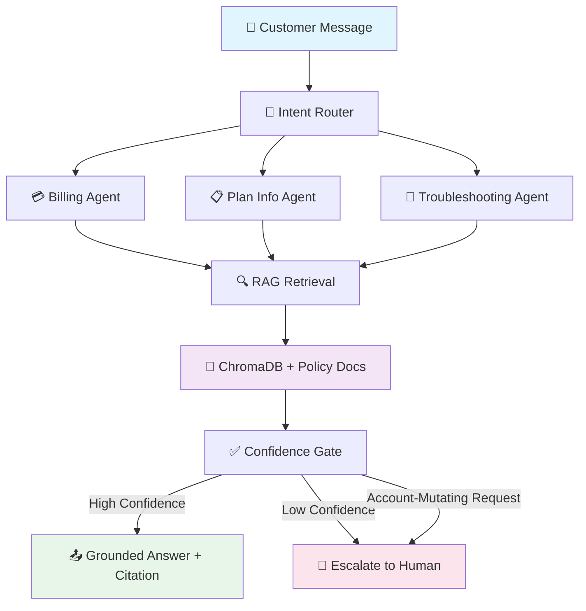

# 🤖 Telecom Support Agent

<div align="center">


[](https://github.com/AIstar007/telecom-support-agent/actions/workflows/ci.yml)


**Multi-Agent RAG Support Bot — Grounded in Real Policy Docs**

*Answers billing, plan, and troubleshooting questions accurately — and knows exactly when to escalate to a human.*

---

[](https://github.com/AIstar007/telecom-support-agent)
[](http://localhost:8000/docs)
[](./SUBMISSION.md)
[](LICENSE)

> 🏆 Built for **The Talent Hack** · Deutsche Telekom Digital Labs · AI Engineer Track  
> See [`SUBMISSION.md`](./SUBMISSION.md) for the full hackathon write-up and architecture rationale.

</div>

---

## 🌟 Platform Overview

### 🎯 Project Vision

The Telecom Support Agent is a production-grade multi-agent AI system that handles real customer support queries — grounded entirely in policy documents, with zero hallucinated answers. Every response is retrieved from actual telecom policy docs, cited at the source, and confidence-gated before delivery. When the system isn't certain enough, or when a request would mutate account state, it escalates automatically — never silently fails.

<div align="center">



</div>

### ✨ Core Capabilities

| Feature | Technology | Detail |
|---------|------------|--------|
| 🎯 **Intent Classification** | Rule-based + LLM | billing / plan_info / troubleshooting / out_of_scope |
| 📄 **RAG-Grounded Answers** | ChromaDB | Section-aware chunking on `##` markdown headers |
| 🤖 **Domain-Specific Agents** | Injectable LLM pipeline | 3 specialized agents + orchestrator |
| 🛡️ **Confidence Gate** | Deterministic threshold | Numeric score — not an LLM self-report |
| 🚨 **Escalation Guard** | Keyword-rule engine | Refund / cancel / plan-switch → always human |
| 🧪 **Zero-API Testing** | Stub injection | Full pipeline testable without an Azure OpenAI key |
| 🐳 **Containerized** | Docker | One-command deployment |

---

## 🏗️ System Architecture

### 🎨 Agent Pipeline Design

```
                      ┌──────────────────────────────┐
  User message ──────▶│       Intent Router           │
                      │  billing / plan_info /         │
                      │  troubleshooting / out_of_scope│
                      └──────────────┬───────────────┘
                                     │
              ┌──────────────────────┼──────────────────────┐
              ▼                      ▼                      ▼
     ┌─────────────────┐   ┌──────────────────┐   ┌──────────────────────┐
     │  💳 Billing      │   │  📋 Plan Info    │   │  🔧 Troubleshooting  │
     │  Agent           │   │  Agent           │   │  Agent               │
     └────────┬─────────┘   └────────┬─────────┘   └──────────┬───────────┘
              │                      │                         │
              └──────────────────────┼─────────────────────────┘
                                     ▼
                         ┌───────────────────────┐
                         │    🔍 RAG Retrieval    │
                         │  ChromaDB + Policy Docs│
                         │  Section-aware chunks  │
                         └───────────┬────────────┘
                                     ▼
                         ┌───────────────────────┐
                         │   ✅ Confidence Gate   │
                         │  threshold: numeric    │
                         │  mutating: keyword rule│
                         └───────────┬────────────┘
                           ┌─────────┴──────────┐
                           ▼                    ▼
                  📤 Grounded Answer      🚨 Escalate to Human
                  + Source Citation       (ticket reference)
```

### 📂 Project Structure

```
telecom-support-agent/
│
├── 📁 app/
│   ├── 📁 agents/
│   │   ├── intent_agent.py             # billing / plan_info / troubleshooting / out_of_scope
│   │   ├── billing_agent.py            # RAG-grounded billing answers
│   │   ├── plan_agent.py               # RAG-grounded plan comparisons
│   │   ├── troubleshooting_agent.py    # RAG-grounded troubleshooting steps
│   │   ├── escalation_agent.py         # deterministic escalation gate
│   │   └── orchestrator.py             # full pipeline wiring + error handling
│   │
│   ├── 📁 rag/
│   │   ├── embeddings.py               # offline hashing embedder (zero model download)
│   │   ├── ingest.py                   # chunk + embed + load policy docs
│   │   └── retriever.py                # retrieval wrapper, fails soft to []
│   │
│   ├── llm.py                          # Azure OpenAI client (only wired in when key is present)
│   └── main.py                         # FastAPI app + conditional LLM wiring
│
├── 📁 data/policies/                   # sample billing, plan, troubleshooting docs
├── 📁 tests/                           # 29 tests — unit + API layer
│   ├── test_intent_agent.py
│   ├── test_billing_agent.py
│   ├── test_plan_agent.py
│   ├── test_troubleshooting_agent.py
│   ├── test_escalation_gate.py
│   ├── test_retrieval.py
│   ├── test_orchestrator.py
│   └── test_api.py                     # FastAPI TestClient
│
├── SUBMISSION.md                       # Hackathon write-up + rationale
├── Dockerfile
├── .env.example
└── requirements.txt
```

---

## 🤖 Specialized Agent System

### 🎯 Five Agents, One Pipeline

<table width="100%">
<tr>
<td width="50%" valign="top">

#### **1. 🎯 Intent Router**
```yaml
Role: Entry point classifier

Classifies into:
  - billing         Bill queries, payment issues
  - plan_info       Plan comparisons, upgrades
  - troubleshooting Network, device, connectivity
  - out_of_scope    Routes away gracefully

Method:
  - Rule-based primary pass
  - LLM fallback for ambiguous input
  - Stub fallback when no API key set

Output:
  - intent_label
  - confidence_score
  - routed_agent
```

#### **2. 💳 Billing Agent**
```yaml
Role: Billing & payment specialist

Handles:
  - Unexpected charge queries
  - Invoice breakdown requests
  - Payment failure investigation
  - Roaming charge explanations

Method:
  - ChromaDB retrieval on billing docs
  - Section-aware policy matching
  - Citation extraction from chunks

Output:
  - Grounded answer
  - Source citation (doc + section)
  - Confidence score
```

</td>
<td width="50%" valign="top">

#### **3. 📋 Plan Info Agent**
```yaml
Role: Plan comparison specialist

Handles:
  - Plan feature comparisons
  - Upgrade / downgrade info
  - Add-on and bundle details
  - Contract term queries

Method:
  - ChromaDB retrieval on plan docs
  - Multi-chunk context assembly
  - Comparative answer synthesis

Output:
  - Grounded comparison
  - Source citation
  - Confidence score
```

#### **4. 🔧 Troubleshooting Agent**
```yaml
Role: Technical support specialist

Handles:
  - Network connectivity issues
  - Device configuration problems
  - Service outage queries
  - Signal and speed issues

Method:
  - ChromaDB retrieval on tech docs
  - Step-by-step answer extraction
  - Escalation if steps exceed scope

Output:
  - Grounded troubleshooting steps
  - Source citation
  - Confidence score
```

</td>
</tr>
<tr>
<td colspan="2" align="center" valign="top">

#### **5. 🛡️ Escalation Gate (Confidence Guard)**
```yaml
Role: Quality gate + safety enforcer

Triggers escalation on:
  Keyword rule (deterministic):         Numeric threshold:
  - "refund" / "get my money back"      - confidence_score < threshold
  - "cancel" / "close my account"       - retrieval returns []
  - "switch plan" / "change plan"       - answer flagged low-certainty

Why deterministic (not LLM self-report):
  The model proposes answers.
  It never decides on its own that it is "confident enough."
  Mutating requests are caught by rule — not by asking the LLM if it feels sure.

Output:
  - escalate: true/false
  - reason: "low_confidence" | "account_mutating" | "out_of_scope"
  - ticket_reference: TKT-{uuid}
```

</td>
</tr>
</table>

---

## 🔍 RAG Pipeline

### 📄 Section-Aware Chunking

Chunks split on markdown `##` headers — not fixed character windows. Topical coherence per chunk matters more for retrieval quality than raw chunk size.

```python
# ingest.py — section-aware chunking
def chunk_policy_doc(text: str) -> list[str]:
    """Split on ## headers to preserve topical coherence."""
    sections = re.split(r'\n##\s+', text)
    return [s.strip() for s in sections if s.strip()]

# Each chunk = one coherent policy topic
# e.g. "## Roaming Charges" stays together as one retrieval unit
```

### 🧠 Offline Hashing Embedder

`app/rag/embeddings.py` uses a keyword-overlap based hashing embedder — no `sentence-transformers`, no external model download. The project runs immediately in network-locked environments.

```python
# embeddings.py — swap-ready interface
class BaseEmbedder(ABC):
    @abstractmethod
    def embed(self, text: str) -> list[float]: ...

class HashingEmbedder(BaseEmbedder):
    """Offline keyword-overlap embedder. Zero external calls."""
    def embed(self, text: str) -> list[float]: ...

class AzureOpenAIEmbedder(BaseEmbedder):
    """Drop-in Azure OpenAI embedder for production semantic search."""
    def embed(self, text: str) -> list[float]: ...
```

> Swap `HashingEmbedder` → `AzureOpenAIEmbedder` in `config.py` for production-grade semantic search. The interface is identical.

---

## 🧪 Testing

### 📊 Coverage Breakdown

```bash
pip install -r requirements-dev.txt
pytest tests/ --cov=app --cov-report=term-missing
```

**29 tests · 85% coverage**

| Module | Tests | What's Covered |
|--------|-------|----------------|
| `intent_agent.py` | 4 | All 4 intent labels, ambiguous input |
| `billing_agent.py` | 3 | Grounded answer, citation, stub fallback |
| `plan_agent.py` | 3 | Plan comparison, multi-chunk context |
| `troubleshooting_agent.py` | 3 | Step extraction, empty retrieval |
| `escalation_agent.py` | 5 | Keyword rule, numeric threshold, both triggers |
| `retriever.py` | 4 | Match, no-match, soft fail to `[]` |
| `orchestrator.py` | 4 | Full pipeline, error handling |
| `api.py` | 3 | `/chat` endpoint via FastAPI `TestClient` |

### 🔌 Injectable LLM — Test Without Azure OpenAI Credentials

Every agent accepts an injectable `llm_call` parameter. The full pipeline is unit-testable without touching a real Azure OpenAI deployment:

```python
# In tests — inject a stub instead of Azure OpenAI
def stub_llm(system_prompt: str, user_message: str) -> str:
    return "STUB: This is a test answer."

agent = BillingAgent(llm_call=stub_llm)
result = agent.answer("Why is my bill higher?")
assert result.confidence > 0
assert result.source_citation is not None
```

```python
# In production — real Azure OpenAI client is wired in only when
# all required Azure credentials are configured.

# app/main.py
ACTIVE_LLM_CALL = (
    azure_llm_call
    if all(
        [
            os.getenv("AZURE_OPENAI_API_KEY"),
            os.getenv("AZURE_OPENAI_ENDPOINT"),
            os.getenv("AZURE_OPENAI_API_VERSION"),
            os.getenv("AZURE_OPENAI_DEPLOYMENT"),
        ]
    )
    else stub_llm
)

orchestrator = Orchestrator(llm_call=ACTIVE_LLM_CALL)
```

### 🔐 Required Azure OpenAI Environment Variables

```env
AZURE_OPENAI_API_KEY=xxxxxxxxxxxxxxxx

AZURE_OPENAI_ENDPOINT=https://<your-resource>.openai.azure.com/

AZURE_OPENAI_API_VERSION=2024-12-01-preview

AZURE_OPENAI_DEPLOYMENT=<your-deployment-name>
```

---

## ⚡ Quick Start

### 📋 Prerequisites

```yaml
Required:
  - Python: 3.11+
  - pip: latest

Optional:
  - AZURE_OPENAI_API_KEY: for real LLM answers (stubs work without it)

System:
  - RAM: 4GB minimum
  - Internet: only needed if using real Azure OpenAI
```

### 🚀 Installation

#### Step 1 — Clone & Install
```bash
git clone https://github.com/AIstar007/telecom-support-agent.git
cd telecom-support-agent

python -m venv venv
source venv/bin/activate        # macOS / Linux
# venv\Scripts\activate         # Windows

pip install -r requirements.txt
```

#### Step 2 — Ingest Policy Docs
```bash
# Run once — or whenever your policy docs change
python -m app.rag.ingest
```

#### Step 3 — Configure Environment
```bash
cp .env.example .env
```

```bash
# .env — full configuration
OPENAI_API_KEY=sk-your_key_here   # optional — stubs work without it

# Retrieval settings
RETRIEVAL_TOP_K=3
CONFIDENCE_THRESHOLD=0.65

# Escalation keywords (pipe-separated)
MUTATING_KEYWORDS=refund|cancel|switch plan|close account|change plan
```

#### Step 4 — Start the Server
```bash
uvicorn app.main:app --reload
```

> ✅ **Zero setup required to see it work.** Every agent uses deterministic stub logic when no `OPENAI_API_KEY` is set. Routing, retrieval, and escalation are all real and testable immediately.

---

## 🌐 API Usage

### Endpoints

```bash
# Health check
GET  /health

# Send a support message
POST /chat
```

### Chat Endpoint

```bash
curl -X POST http://localhost:8000/chat \
  -H "Content-Type: application/json" \
  -d '{"session_id": "demo", "message": "why is my bill higher this month"}'
```

**Response — Grounded Answer:**
```json
{
  "answer": "Your bill may be higher due to international roaming charges applied between the 3rd–8th. Per our Billing Policy §4.2, roaming rates apply when your device connects to a non-home network.",
  "source_citation": "billing_policy.md ## Roaming Charges",
  "confidence": 0.87,
  "escalated": false,
  "intent": "billing"
}
```

**Response — Escalated:**
```json
{
  "answer": null,
  "escalated": true,
  "reason": "account_mutating",
  "ticket_reference": "TKT-8a3f91c2",
  "message": "This request has been escalated to a human agent. Reference: TKT-8a3f91c2"
}
```

---

## 🐳 Docker

```bash
docker build -t telecom-support-agent .
docker run -p 8000:8000 --env-file .env telecom-support-agent
```

---

## 🎨 Design Decisions

| Decision | Rationale |
|----------|-----------|
| **Offline hashing embedder** | No model download; runs in network-locked environments. Swap-ready interface for semantic embeddings in production. |
| **Section-aware chunking** (`##` splits) | Topical coherence per chunk matters more for retrieval quality than raw chunk size. |
| **Deterministic escalation gate** | The model proposes answers. It never decides on its own that it's confident enough. Keyword rule catches mutating requests; numeric threshold catches low-certainty answers. |
| **Injectable `llm_call`** | Full pipeline testable without hitting a real API. Same mechanism conditionally wires in real OpenAI client when key is present. |
| **No LangChain** | Explicit agent logic, no abstraction overhead — every step is traceable and independently testable. |

---

## 🗺️ Roadmap

| Feature | Status |
|---------|--------|
| Real DTDL policy corpus | 🔜 Planned |
| Auth + account-lookup integration | 🔜 Planned |
| Semantic embeddings (OpenAI / sentence-transformers) | 🔜 Planned (interface ready) |
| Streaming responses | 🔜 Planned |
| Multi-turn conversation memory | 🔜 Planned |

---

## 🧱 Tech Stack

| Layer | Technology |
|-------|------------|
| API Framework | [FastAPI](https://fastapi.tiangolo.com/) |
| Vector Store | [ChromaDB](https://www.trychroma.com/) |
| LLM | [OpenAI](https://openai.com/) — optional, stubs work without it |
| Embeddings | Offline hashing embedder (swap-ready for semantic) |
| Testing | [pytest](https://pytest.org/) + FastAPI `TestClient` |
| CI | GitHub Actions |
| Containerization | Docker |

---

<div align="center">

## 🚀 Get Started in Minutes

[](https://github.com/AIstar007/telecom-support-agent)
[](http://localhost:8000/docs)
[](./SUBMISSION.md)

---

### 🤖 Policy-Grounded · Confidence-Gated · Human-Escalating

*Built with ❤️ for Deutsche Telekom Digital Labs — The Talent Hack, AI Engineer Track*

**🌟 Star this repo if you value production-ready AI design!** · **🐛 [Report Issues](https://github.com/AIstar007/telecom-support-agent/issues)** · **💡 [Request Features](https://github.com/AIstar007/telecom-support-agent/issues)**

**📄 License:** MIT · **👨‍💻 Author:** Alen Thomas (AIstar007)

</div>
